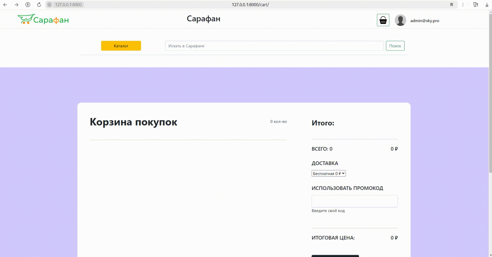
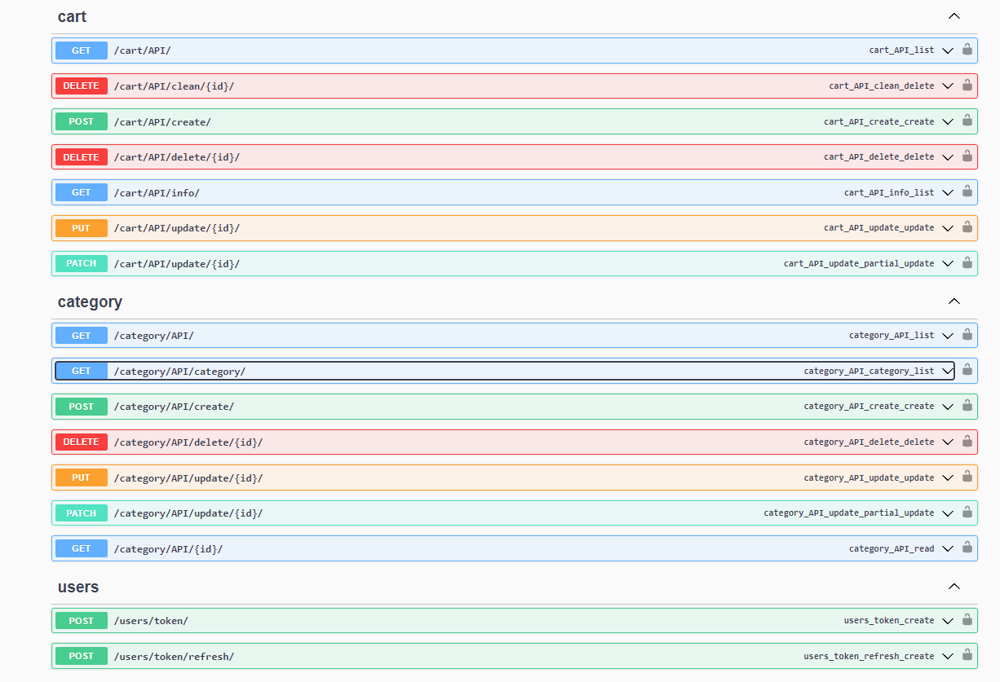

# Магазин Sarafan

Реалиализован проект "магазина продуктов" (категории, подкатегории, продукты)

## Содержание

- [Примеры_функционала](#использование)
- [Старт проекта](#старт)
- [Технологии](#технологии)
- [Техническое задание](#тз)

## Разработка

### Требования

Для установки и запуска проекта, необходим [Python](https://www.python.org/downloads/)
v3.12, [PostgreSQL](https://www.postgresql.org/download/windows/) 15.7
<hr>

## Старт

Шаг 1. Создайте файл с названием ".env" и заполните пустые поля:

<H3 style="text-align: center; color:#A7FC00;">Шаблон для файла .env </H3>
<div style="display: flex; justify-content: center;">

```dotenv
POSTGRES_DB=
POSTGRES_PASSWORD=
POSTGRES_USER=postgres
POSTGRES_HOST=localhost
POSTGRES_PORT=5432
```

</div>

### Установка зависимостей

Шаг 2. Для установки зависимостей, выполните команду:

```pip install -r .\requirements.txt ```

Шаг 3. Выполните команды из примера ниже:
<br>

| Описание                                         | Команды                        |
|--------------------------------------------------|--------------------------------|
| ✔️ Приминить миграции                            | ```python manage.py migrate``` |
| ✔️ Создать пользователей                         | ```python manage.py ccsu```    |
| ✔️ Заполнить (Категории, Подкатегории, Продукты) | ```python manage.py data```    |

## Использование

<H6>Сайт</H6>


<H6>Админка</H6>



<H6>API</H6>



## Технологии

- [DJANGO](https://www.djangoproject.com/)
- [DJANGO REST FRAMEWORK](https://www.django-rest-framework.org/)
- [DRF-YASG](https://drf-yasg.readthedocs.io/en/stable/readme.html)
- [PSYCOPG2](https://www.psycopg.org/)
- [SIMPLEJWT](https://github.com/jazzband/djangorestframework-simplejwt)

## ТЗ

### Реализовать проект магазина продуктов со следующим функционалом:

+ <p style="color:green">Должна быть реализована возможность создания, редактирования, удаления категорий и подкатегорий товаров в админке.</p>

+ <p style="color:green">Категории и подкатегории обязательно должны иметь наименование, slug-имя, изображение</p>

+ <p style="color:green">Подкатегории должны быть связаны с родительской категорией</p>

+ <p style="color:green">Должен быть реализован эндпоинт для просмотра всех категорий с подкатегориями. Должны быть предусмотрена пагинация.</p>

+ <p style="color:green">Должна быть реализована возможность добавления, изменения, удаления продуктов в админке.</p>

+ <p style="color:green">Продукты должны относится к определенной подкатегории и, соответственно категории, должны иметь
  наименование, slug-имя, изображение в 3-х размерах, цену </p>

+ <p style="color:green">Должен быть реализован эндпоинт вывода продуктов с пагинацией. Каждый продукт в выводе должен иметь поля наименование,
  slug, категория, подкатегория, цена, список изображений </p>

+ <p style="color:green">Реализовать эндпоинт добавления, изменения (изменение количества), удаления продукта в корзине.</p>

+ <p style="color:green">Реализовать эндпоинт вывода состава корзины с подсчетом количества товаров и суммы стоимости товаров в корзине.</p>

+ <p style="color:green">Реализовать возможность полной очистки корзины</p>

+ <p style="color:green">Операции по эндпоинтам категорий и продуктов может осуществлять любой пользователь</p>

+ <p style="color:green">Операции по эндпоинтам корзины может осуществлять только авторизированный пользователь и только со своей корзиной</p>

+ <p style="color:green">Реализовать авторизацию по токену</p>

+ <p style="color:green">Проект можно реализовать на одном из фреймворков: Django Rest Framework, Fast Api, Flask</p>

## FAQ

<a href="https://t.me/Illustrator_v">
    
</a>
